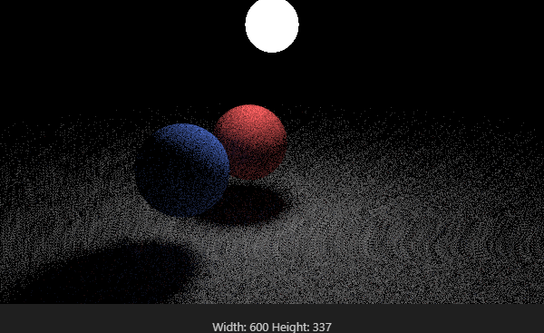

# raytracing
Learning history for ray tracing
# The Final Image is as below



And this is the parameters:


    ```    
    auto material_ground = make_shared<lambertian>(color(0.5, 0.5, 0.5)); 
    auto material_center = make_shared<lambertian>(color(0.7, 0.1, 0.1)); 
    auto material_left   = make_shared<lambertian>(color(0.1, 0.2, 0.7)); 
    auto material_light  = make_shared<diffuse_light>(color(15, 15, 15)); 

    world.add(make_shared<sphere>(point3( 0.0, -100.5, -1.0), 100.0, material_ground));
    world.add(make_shared<sphere>(point3( 0.0,    0.5, -1.5),   0.5, material_center));
    world.add(make_shared<sphere>(point3(-1.2,    0.5, -1.0),   0.5, material_left));
    world.add(make_shared<sphere>(point3( 0.0,    2.0, -1.0),   0.3, material_light)); 

    // Camera
    camera cam;

    cam.aspect_ratio      = 16.0 / 9.0;
    cam.image_width       = 600;
    cam.samples_per_pixel = 200;
    cam.max_depth         = 50;  // Set a global maximum number of bounces

    cam.vfov     = 40;
    cam.lookfrom = point3(-3,2,3);
    cam.lookat   = point3(0, 0.5, -1.0);
    cam.vup      = vec3(0,1,0);

    cam.initialize();
    ```